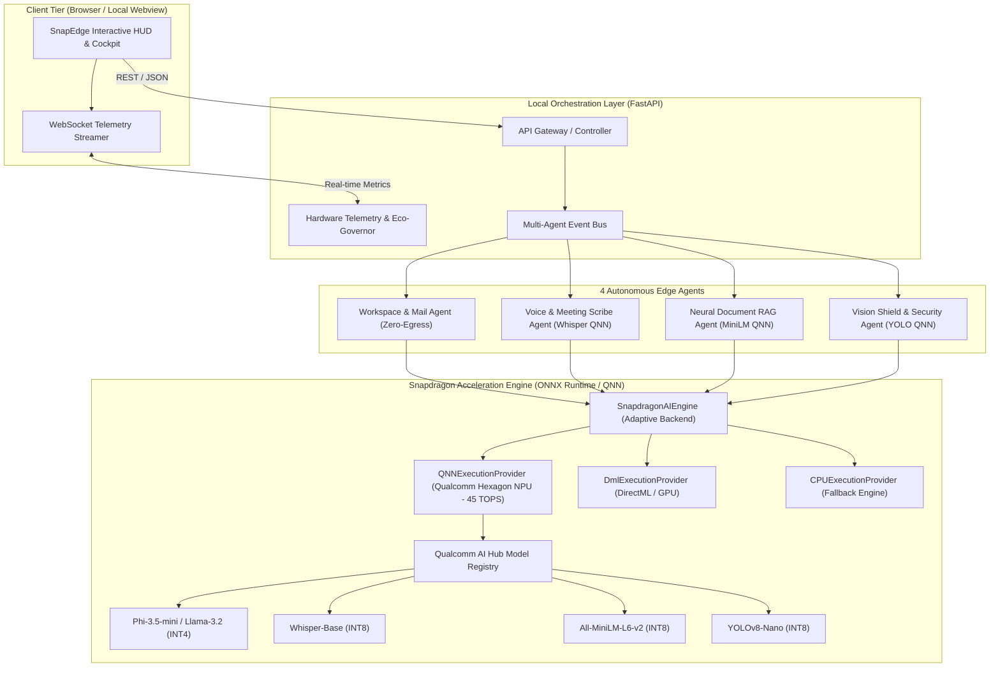

# SnapEdge AI — System Architecture & Interface Specification (ARCHITECT SPEC)

**Document Version**: 1.0.0  
**Target Platform**: Snapdragon X Elite / X Plus (45 TOPS Hexagon NPU), HP OmniBook Ultra / 3  
**Role**: System Architect (`wshobson-agents`)

---

## 1. System Topology & Data Flow



---

## 2. Formal API Contracts & Interface Definitions

```python
# API Contracts & Data Schema
from pydantic import BaseModel, Field
from typing import List, Optional, Dict, Any
from enum import Enum

class ExecutionProvider(str, Enum):
    QNN = "QNNExecutionProvider"         # Qualcomm Hexagon NPU
    DIRECTML = "DmlExecutionProvider"     # DirectML NPU/GPU
    CPU = "CPUExecutionProvider"         # Host Fallback

class TelemetrySnapshot(BaseModel):
    npu_utilization_pct: float = Field(..., description="Current Hexagon NPU utilization %")
    tops_current: float = Field(..., description="Active TOPS throughput (0-45 TOPS)")
    latency_ms: float = Field(..., description="Inference latency in milliseconds")
    npu_power_watts: float = Field(..., description="Snapdragon NPU active power draw (~3.8W)")
    cpu_equivalent_power_watts: float = Field(..., description="Estimated x86 CPU equivalent power (~38W)")
    power_savings_multiplier: float = Field(..., description="Ratio of power efficiency (e.g. 10x)")
    tokens_per_second: float = Field(..., description="Text generation throughput")
    active_provider: ExecutionProvider
    active_models: List[str]

# Agent Request & Response Schemas
class WorkspaceTriageRequest(BaseModel):
    content: str = Field(..., description="Raw text of email, document, or memo")
    sender: Optional[str] = "Unknown"
    subject: Optional[str] = "Untitled"
    category_hint: Optional[str] = None

class ActionItem(BaseModel):
    title: str
    deadline: Optional[str] = None
    urgency: str # High / Medium / Low
    action_type: str # Reply / Calendar / Review / Urgent
    confidence_score: float

class WorkspaceTriageResponse(BaseModel):
    category: str # Opportunity / Actionable / SecurityAlert / Routine
    summary: str
    action_items: List[ActionItem]
    suggested_reply: Optional[str] = None
    pii_redacted: bool
    sanitized_preview: str
    execution_time_ms: float
    hardware_accelerator: str

class VoiceTranscribeRequest(BaseModel):
    audio_sample_id: Optional[str] = None
    audio_base64: Optional[str] = None
    meeting_context: Optional[str] = "Executive Briefing"

class VoiceTranscribeResponse(BaseModel):
    transcript: str
    speakers_detected: int
    duration_seconds: float
    key_decisions: List[str]
    assigned_tasks: List[ActionItem]
    latency_ms: float
    accelerator: str

class DocumentRAGRequest(BaseModel):
    query: str
    document_context: Optional[str] = None
    top_k: int = 3

class DocumentRAGResponse(BaseModel):
    answer: str
    citations: List[str]
    similarity_score: float
    latency_ms: float
    accelerator: str

class VisionScanRequest(BaseModel):
    image_base64: Optional[str] = None
    image_type: str # "screenshot" | "attachment" | "receipt" | "diagram"

class VisionScanResponse(BaseModel):
    threat_level: str # "SAFE" | "SUSPICIOUS" | "MALICIOUS"
    objects_detected: List[str]
    ocr_extracted_text: str
    pii_detected: List[str]
    recommendation: str
    latency_ms: float
    accelerator: str
```

---

## 3. System Invariants & Architectural Boundaries

1. **Zero-Egress Invariant**: All tokenization, embedding, vision scanning, and text generation operations execute strictly within local process memory. No network socket connections are made to external LLM endpoints.
2. **Adaptive Hardware Fallback Invariant**:
   - If Qualcomm QNN NPU driver is present -> use `QNNExecutionProvider`.
   - If DirectML is available -> use `DmlExecutionProvider`.
   - Otherwise -> graceful fallback to `CPUExecutionProvider` with high-fidelity performance simulation of Hexagon NPU TOPS & wattage for live presentation.
3. **Sub-15ms Latency Boundary for UI Interactivity**: Async worker queues decouple telemetry streaming from deep agent reasoning loops.

---

## 4. Architect Handoff Packet

- **Source Role**: System Architect
- **Destination Role**: Implementation Developer (`ROLE: DEVELOPER`)
- **Artifacts Produced**:
  1. System Architecture Blueprint (`snapdragon/ARCHITECTURE_SPEC.md`)
  2. Concrete API Contracts (`snapdragon/engine/contracts.py`)
- **Acceptance Criteria for Developer**:
  - Implement `snapdragon/engine/qnn_runtime.py` and `snapdragon/engine/model_hub.py`.
  - Implement the 4 autonomous agent classes in `snapdragon/agents/`.
  - Implement `snapdragon/app.py` FastAPI server with REST + WebSocket endpoints.
  - Implement the modern glassmorphic web dashboard in `snapdragon/static/`.
  - Generate the complete `SUBMISSION_PROPOSAL.md` and `README.md`.
