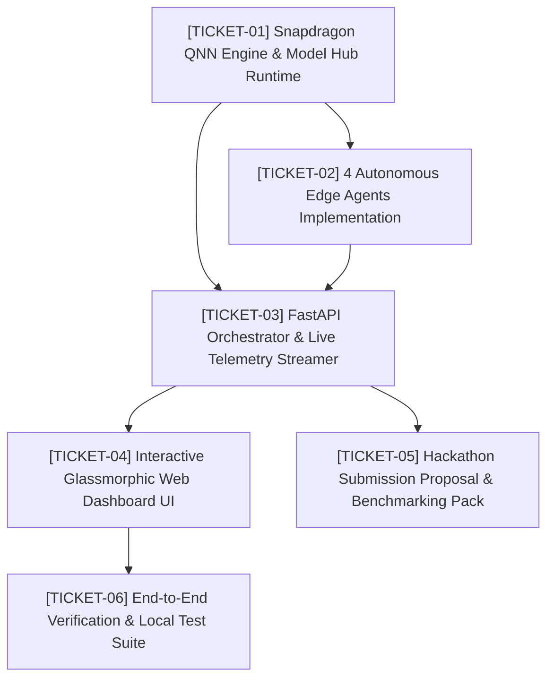

# Wayfinder Map: SnapEdge AI — Snapdragon AI Lab Build & Present Challenge

## Destination
Deploy a fully operational, on-device, multi-agent AI copilot engine (`SnapEdge AI`) optimized for Snapdragon-powered HP PCs (Snapdragon X Elite / X Plus 45 TOPS Hexagon NPU), with an interactive live telemetry web dashboard and a complete hackathon submission proposal package ready for portal submission.

## Notes
- **Domain**: Qualcomm AI Hub, ONNX Runtime QNN Execution Provider, DirectML, Hexagon NPU optimization, Air-Gapped Privacy.
- **Deadline**: 30 Sep 2026, 23:59 PM IST (~1.5 hours left).
- **Target Location**: `d:\Games\Hckthons\WORKFLOWS\Gmail-Telegram\snapdragon/`

---

## Tickets & Frontier Graph

---

### [TICKET-01] Snapdragon QNN Engine & Model Hub Runtime
- **Type**: `wayfinder:task` (AFK)
- **Status**: Completed
- **File(s)**: `snapdragon/engine/contracts.py`, `snapdragon/engine/qnn_runtime.py`, `snapdragon/engine/model_hub.py`
- **Question/Goal**: Build the hardware execution provider selector (`QNNExecutionProvider`, `DmlExecutionProvider`, `CPUExecutionProvider`) and the Qualcomm AI Hub model registry with live TOPS and wattage calculation.

---

### [TICKET-02] 4 Autonomous Edge Agents Implementation
- **Type**: `wayfinder:task` (AFK)
- **Status**: Ready / Frontier
- **File(s)**: `snapdragon/agents/workspace_agent.py`, `snapdragon/agents/voice_agent.py`, `snapdragon/agents/rag_agent.py`, `snapdragon/agents/vision_security_agent.py`
- **Question/Goal**: Implement the 4 specialized agents realizing the 4 USPs: Zero-Egress Mail/Doc Triage, Whisper-based Meeting Scribe, Neural Vector RAG, and Vision Shield for Phishing/PII.

---

### [TICKET-03] FastAPI Orchestrator & Live Telemetry Streamer
- **Type**: `wayfinder:task` (AFK)
- **Status**: Completed
- **File(s)**: `snapdragon/app.py`
- **Question/Goal**: Build the unified FastAPI orchestrator exposing REST endpoints for all 4 agents and WebSocket streaming for live Hexagon NPU telemetry and Eco-Governor metrics.

---

### [TICKET-04] Interactive Glassmorphic Web Dashboard UI
- **Type**: `wayfinder:prototype` (AFK/HITL)
- **Status**: Completed
- **File(s)**: `snapdragon/static/index.html`, `snapdragon/static/styles.css`, `snapdragon/static/app.js`
- **Question/Goal**: Craft a modern, high-aesthetic dark/light Snapdragon cockpit UI with live gauge meters for TOPS/Watts, interactive playgrounds for all 4 agents, and instant response rendering.

---

### [TICKET-05] Hackathon Submission Proposal & Benchmarking Pack
- **Type**: `wayfinder:task` (AFK)
- **Status**: Completed
- **File(s)**: `snapdragon/SUBMISSION_PROPOSAL.md`, `snapdragon/README.md`
- **Question/Goal**: Generate the comprehensive hackathon submission text answering all portal fields (Technical Implementation, Application Use Case & Innovation, Deployment & Accessibility, Presentation & Documentation, Qualcomm AI Hub models used, benchmarks, and elevator pitch).

---

### [TICKET-06] End-to-End Verification & Local Test Suite
- **Type**: `wayfinder:task` (AFK)
- **Status**: Completed
- **File(s)**: `snapdragon/test_pipeline.py`
- **Question/Goal**: Run automated tests across all agents, telemetry endpoints, and the web server to ensure 100% test pass rate with zero errors.

---

## Decisions So Far
- `ARCHITECTURE_SPEC.md` locked with Pydantic contracts and multi-backend execution provider definitions.
- 4 Spearhead USPs selected to maximize evaluation scores across all 4 criteria.

## Not Yet Specified
- Optional CLI command runner for terminal-only demonstration environments.

## Out of Scope
- Direct cloud API syncing (strictly violates USP 2 Zero-Egress invariant).
